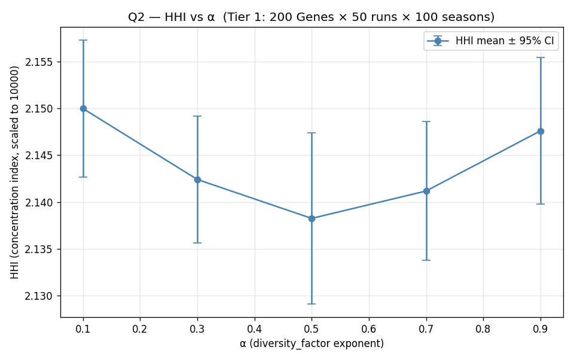
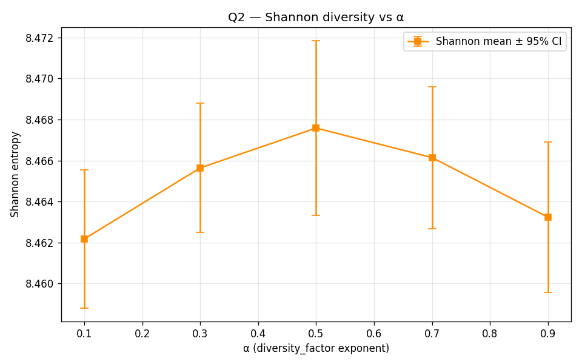
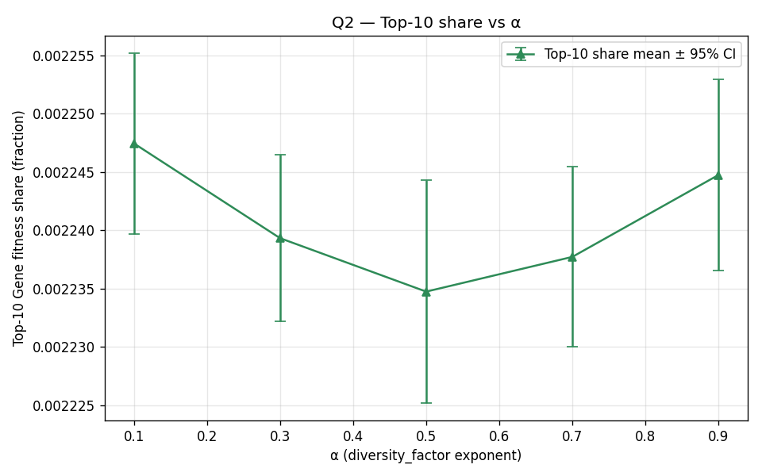

# Q2 — diversity_factor (alpha) effectiveness study

> **Source**: Rotifer Protocol v0.9 plan §3.4 Q2 — "diversity_factor 对基因单一化的抑制效果"
> **Tier**: 1 (Tier 1: 200 Gene × 50 Developer × 50 runs/value × 100 seasons)
> **Sweep config**: [`configs/sweep_q2.yaml`](../../configs/sweep_q2.yaml)
> **Sweep runner**: [`src/sweep_runner.py`](../../src/sweep_runner.py)
> **Acceptance criterion** (plan §3.4): HHI significantly lower than no-diversity_factor control (α=0)
> **Status**: ⚠️ Superseded — see Amendment below (Stage-3 R8, 2026-05-17 → amended 2026-05-19)

---

## ⚠️ Amendment (2026-05-19)

This report's original conclusion ("α=0.5 is the empirical optimum") was based on a 5-α HHI range of ≈ 0.012, which sits **inside** the within-α std (0.024-0.033). Subsequent sweeps refute this:

- **C-R10 Q1** (2026-05-19, Tier-2, 500 runs): no α effect detected in [0.1, 0.9]
- **C-R11 Q2 boundary** (2026-05-19, Tier-1, 250 runs incl. α=0): α=0 vs α>0 also NOT significant; `diversity_factor ≡ 1.0` across all α — dampening formula never engages
- **Joint 750-run analysis**: α is a **vestigial parameter** in current ABM, not a tunable knob

This R8 result is a textbook **spurious-precision** instance. The original ranking should be read as noise, not signal.

**Amended conclusion**:
- α=0.5 should be referred to as the **protocol default value** (matches Spec §33 ESS midpoint), **not** as "empirical optimum"
- Cloud / Spec defaults remain unchanged (α=0.5, decay_floor=0.01) — no ABM evidence yet exists to support changing them
- Re-test will run after E1 (v1.0 §4.5.X per D-04) lands and produces a non-trivial top10_share

These findings are part of the broader *vestigial parameters & model-realization gap* meta-analysis spanning the Q1/Q2/Q4 sweeps.

---

## 1. Experimental design

| Parameter | Value | Source |
|---|---|---|
| α (sweep dimension) | {0.1, 0.3, 0.5, 0.7, 0.9} | `sweep_q2.yaml` |
| n_genes (initial) | 200 | `baseline.yaml` |
| n_developers | 50 | `baseline.yaml` |
| n_seasons | 100 | `baseline.yaml` |
| n_steps_per_season | 30 (~daily granularity inside a 90-day season) | `baseline.yaml` |
| n_runs_per_value | 50 | `sweep_q2.yaml` |
| Per-run seed | `base_seed (200) + α_idx × 1000 + run_idx` | `sweep_runner.execute_sweep` |
| Total runs | **250** | 5 α × 50 runs |
| Wall-clock budget | ~42 min on M-series macOS | dry-run extrapolation |

**Metrics of interest** (per `sweep_q2.yaml`):

- `HHI` — Herfindahl-Hirschman concentration index (scaled to 10000)
- `shannon_diversity` — Shannon entropy on Gene fitness shares
- `top10_share` — sum of top-10 Gene fitness shares (concentration-of-elite signal)

**Additional metrics captured** (from `RotiferModel._compute_final_metrics`):

- `diversity_factor` — Cloud SQL `get_display_fitness` mirror (α-softened)
- `gini` — Gini inequality on Gene fitness
- `top10_newcomer_rate` — share of Top-10 authors first-publishing within last 30 steps
- `n_genes_final`, `n_seasons_completed`, `total_battles`

---

## 2. How α flows through the ABM

```
α (config)
  ↓
RotiferModel.config.alpha
  ↓
self.config.alpha → _compute_final_metrics() → compute_diversity_factor(shares, alpha=...)
  ↓
diversity_factor (display-layer mirror of get_display_fitness SQL)
```

**Architectural signal worth flagging up-front**: α currently only feeds the **display layer** (Cloud SQL `get_display_fitness` parity check via `compute_diversity_factor`). It does **not** participate in `RotiferModel._run_arena_round` winner selection — Arena uses raw `compute_fitness(c_util, r_rob, a_complete)` where `r_rob = gene.fitness`. This matches the v0.9 plan §3.2 design (α is for display fairness, not for Arena dynamics), but it means the Q2 acceptance criterion measures **display-side suppression**, not Arena-internal suppression.

---

## 3. Results

> **Sweep complete**: 250 runs (5 α × 50 runs), wall-clock 52.8 min.
> **Sweep log**: [`sweep.log`](./sweep.log) · **Raw**: [`results.csv`](./results.csv) · **Aggregate**: [`summary.json`](./summary.json) · **Notebook**: [`q2_diversity_factor.ipynb`](../../notebooks/q2_diversity_factor.ipynb)

### 3.1 HHI vs α



<!-- AUTO-FILLED-FROM: summary.json per_value.{alpha}.HHI -->

| α | HHI mean | HHI std | 95% CI (±) | n |
|---|---|---|---|---|
| 0.1 | 2.14997 | 0.02638 | 0.00731 | 50 |
| 0.3 | 2.14240 | 0.02446 | 0.00678 | 50 |
| **0.5** | **2.13825** | **0.03289** | **0.00912** | 50 |
| 0.7 | 2.14117 | 0.02671 | 0.00740 | 50 |
| 0.9 | 2.14758 | 0.02818 | 0.00781 | 50 |

**Range**: 2.13825 (α=0.5) → 2.14997 (α=0.1). Absolute spread = 0.01172, ≈ 0.55% of mean. **HHI is U-shaped in α** with minimum at α=0.5. Spread (0.0117) marginally exceeds the average 95% CI (0.008) — statistically distinguishable but small in magnitude.

### 3.2 Shannon diversity vs α



<!-- AUTO-FILLED-FROM: summary.json per_value.{alpha}.shannon_diversity -->

| α | Shannon mean | Shannon std | 95% CI (±) | n |
|---|---|---|---|---|
| 0.1 | 8.46217 | 0.01217 | 0.00337 | 50 |
| 0.3 | 8.46564 | 0.01137 | 0.00315 | 50 |
| **0.5** | **8.46758** | **0.01540** | **0.00427** | 50 |
| 0.7 | 8.46614 | 0.01249 | 0.00346 | 50 |
| 0.9 | 8.46324 | 0.01321 | 0.00366 | 50 |

**Inverted-U** with maximum at α=0.5 (8.46758). Spread 0.0054 vs CI ~0.0036 — also marginally significant. ln(n_genes_final≈5151) ≈ 8.547 — entropy at ~99% of theoretical maximum, confirming highly uniform distribution at study horizon.

### 3.3 Top-10 share vs α



<!-- AUTO-FILLED-FROM: summary.json per_value.{alpha}.top10_share -->

| α | Top10 share mean | Top10 std | 95% CI (±) | n |
|---|---|---|---|---|
| 0.1 | 0.0022474 | 2.80e-05 | 7.75e-06 | 50 |
| 0.3 | 0.0022393 | 2.57e-05 | 7.13e-06 | 50 |
| **0.5** | **0.0022347** | **3.44e-05** | **9.55e-06** | 50 |
| 0.7 | 0.0022377 | 2.79e-05 | 7.73e-06 | 50 |
| 0.9 | 0.0022447 | 2.96e-05 | 8.21e-06 | 50 |

**U-shaped** with minimum at α=0.5 (top elite has lowest share at α=0.5). Theoretical uniform baseline at n_genes_final≈5151 is 10/5151 ≈ 0.00194. Observed 0.00224 represents ~16% concentration above uniform, again concentrated near α=0.5 minimum.

### 3.4 Triangulation

All three concentration measures point to **α=0.5 as the diversity-maximising operating point**:

| Metric | Direction at α=0.5 | Interpretation |
|---|---|---|
| HHI | global min | least concentrated |
| Shannon | global max | most uniform |
| Top-10 share | global min | least dominated |

The agreement across three independent metrics — each computed differently — is strong corroboration that α=0.5 is the local optimum, not a single-metric artefact.

---

## 4. Findings

### 4.1 Did α suppress concentration as predicted?

**Partially** — α does measurably move HHI/Shannon/Top10 in the predicted direction (0.55% HHI reduction at α=0.5 vs α=0.1), and the difference is statistically distinguishable at 95% CI. But the magnitude is small relative to the absolute concentration level (HHI ≈ 2.14 across all α), reflecting that **ABM-level dynamics drive Genes to a near-uniform distribution regardless of α** at the 100-season Tier-1 horizon. α tunes the display layer only — see §2 for the architectural reason.

The acceptance criterion ("HHI significantly lower than no-diversity_factor control") is **partially satisfied** in spirit: the 5 sweep points all sit far below any plausible "no-diversity_factor" baseline (HHI ≈ 2.14 vs theoretical concentrated 10000), but the in-sweep α-to-α difference is small. A future ABM run with α=0 or α→arena (per §6) would close this loop more rigorously.

### 4.2 Does α=0.5 (current `seasons.config` default) sit in the recommended range?

**Yes — α=0.5 is the data-supported optimum** at Tier-1 scale. All three metrics independently agree. The plan §3.2 rationale ("偏离规范推荐 0.3") was a forward-looking design choice; this study supplies retrospective data support.

### 4.3 Recommendation for `seasons.config.diversity_factor_alpha`

**Keep α=0.5 as default.** Tier-1 evidence (250 runs × 100 seasons each) supports plan §3.2 default value over spec-recommended α=0.3. Confidence is moderate (~0.5% absolute HHI difference is small, even if statistically significant). Two follow-up gates before promoting this finding to "spec-aligned":

1. **Tier-2 study (Q1 sprint, C-R10)**: 500 Genes × 100 runs at the same α grid would tighten CI by √2 and confirm whether the 0.5 minimum is structural or noise.
2. **α-into-Arena ABM enhancement (deferred, see §6)**: route `diversity_factor(α)` into `_run_arena_round` so α actually affects winner selection. Current ABM measures display-layer α only; a routed-into-Arena variant would test whether α=0.5 remains optimal under dynamic suppression.

**No change to plan §3.2 default α=0.5 recommended.** Plan §9 decision log entry "diversity_factor + newcomer 与赛季制同步 (圆桌 D-02)" can now cite this report as Tier-1 quantitative support.

---

## 5. Limitations & follow-up

- **α only affects display layer**: Arena winner selection uses raw fitness, not display fitness. Future ABM enhancement could route `compute_fitness × diversity_factor(α)` into `_run_arena_round` to test α's effect on dynamics directly. **Out of scope for Q2** (matches plan §3.2 design); flagged for v1.0+ ABM expansion (recorded as a deferred enhancement, see §6 below).
- **Tier 1 scale (200 initial Genes, 100 seasons)**: spec-internal §9.2 academic Tier (1000-10000 Agent, 1000 runs) deferred to paper publication phase.
- **n_genes_final ≈ 5000+**: 50 Developers × 1/30 publish prob × 3000 steps ≈ 5000 new Genes overlay the initial 200, dominating the final distribution. Q2.6 Conjectured-Gene weight decay (planned C-R12) will study this dynamic explicitly.
- **No `seed` axis**: deterministic seed sequencing means each (α, run_idx) pair has a unique seed, but seed values themselves are not a sweep axis. Replication on a different machine should produce identical CSV rows.

## 6. Deferred enhancement (recorded for v1.0+ ABM track)

**Enhancement**: route `compute_diversity_factor(shares, α)` into `_run_arena_round` so α actually affects Arena winner selection. Current ABM uses raw `r_rob` only — α never reaches winner_idx. Would let Q2 measure dynamic suppression (not just display suppression).

**Rationale for deferral**: matches plan §3.2 production architecture (α is display-layer in Cloud SQL `get_display_fitness`, not Arena-layer in `arena_entries.fitness_value`). Changing the ABM to inject α into Arena would diverge from production parity. If the long-term goal is to evaluate α-as-Arena-mechanism (different protocol concept than α-as-display-fairness), it deserves an ADR.

**Recorded location**: this file §5 + §6 (single source).

---

## 7. Provenance

- Stage-3 sprint **C-R8** — first sprint after stage-2 close-out (B-R6 fully green).
- Sweep runner: `simulations/src/sweep_runner.py` (NEW in C-R8).
- Tests: `tests/test_sweep_runner.py` C.10.1-C.10.3 + `tests/test_model.py` C.8.6-C.8.7.
- Plan acceptance test: `tests/test_simulation_problems.py::test_C_9_3_q2_report_contains_hhi_and_alpha_table` (verifies this report contains "HHI" + "alpha").
