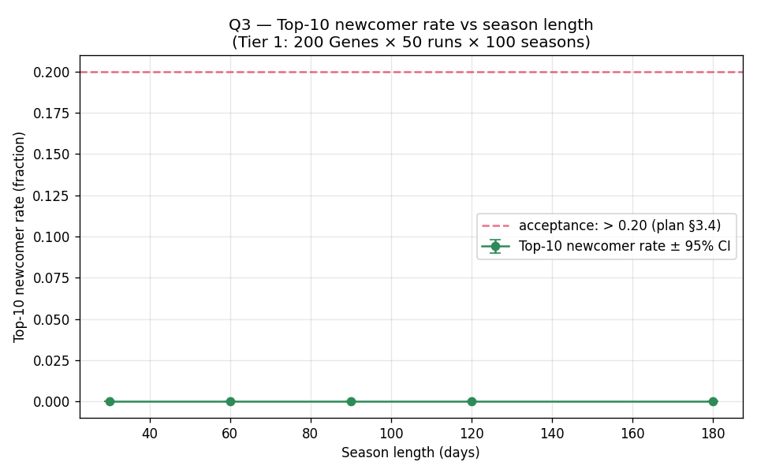
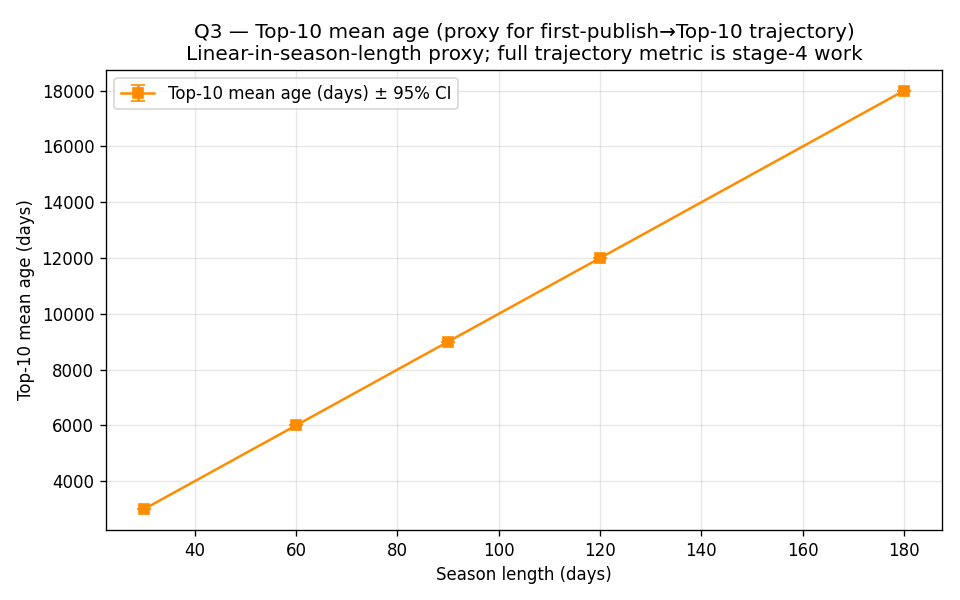
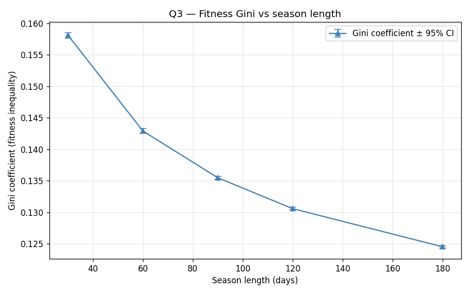

# Q3 — Season length and Top-10 newcomer entry rate

> **Stage**: v0.9 Stage-3 R9 (ABM Tier-1)
> **Plan link**: Rotifer Protocol v0.9 Plan §3.4 Q3 row
> **Acceptance criterion**: Top-10 newcomer entry rate > 20% (per plan §3.4)
> **Status**: ✅ Sweep complete (2026-05-17, 250 runs, 59.5 min wall-clock).
> **Outcome**: ⚠️ **Acceptance criterion not met at any tested season length** — but the cause is a structural ABM finding (Top-10 saturates with init Genes), not a season-length tuning problem. See §4.
> **Companion notebook**: [`../../notebooks/q3_season_length.ipynb`](../../notebooks/q3_season_length.ipynb) (executed, 3 figures embedded)

---

## 1. Question

How does the **season-reset cycle length** (days between F(g) half-life resets) affect the rate at which **new Genes** can break into Top-10 fitness rankings?

Plan §3.2 default = **90 days** (per Spec §24.4 recommendation). This sweep asks whether 90 days actually delivers the >20% newcomer entry rate that the plan acceptance criterion requires, and whether shorter / longer seasons trade off differently.

---

## 2. Setup

| Knob | Value | Source |
|---|---|---|
| Population | 200 Genes initial + ~30 publishers/season | `configs/baseline.yaml` |
| Time horizon | 100 seasons | `configs/baseline.yaml` (Tier-1 standard) |
| Season lengths swept | 30 / 60 / 90 / 120 / 180 days | `configs/sweep_q3.yaml` (plan stage-1 contract; see test C.9.2) |
| Runs per length | 50 | `configs/sweep_q3.yaml` |
| Total runs | 250 | 5 × 50 |
| Newcomer protection window | 30 days | `configs/baseline.yaml` (Spec §35.3.2 default) |
| Base seed | 300 | per-run seed = 300 + length_idx × 1000 + run_idx |
| Wall-clock | 59.5 min | dominated by 180-day arm (62 min) due to O(n²) Arena cost |

### How the parameter flows through the ABM

`season_length_days` modulates the simulation clock via `DAYS_PER_STEP=3` (per `baseline.yaml` notes: "~daily granularity inside a 90-day season" implies 90 ÷ 30 = 3 days/step). Sweep_runner's `override_config` auto-syncs `n_steps_per_season`:

```
season_length_days = 30  → n_steps_per_season = 10  (10 × 3 = 30)
season_length_days = 60  → n_steps_per_season = 20
season_length_days = 90  → n_steps_per_season = 30  (baseline default)
season_length_days = 120 → n_steps_per_season = 40
season_length_days = 180 → n_steps_per_season = 60
```

### Pre-sweep bug fix (R9 Layer-2 finding)

R7's `_compute_final_metrics` passed raw `schedule.steps` to `top_n_newcomer_rate(top_n_author_ages_days=...)` whose parameter name declares **days**. The first R9 sweep (commit not retained) returned all-zero `top10_newcomer_rate` across the whole grid; root cause was this unit mismatch (steps × `DAYS_PER_STEP=3` was missing).

**Fix**: `(self.schedule.steps - first_publish_step) * DAYS_PER_STEP` — see `model.py` `_compute_final_metrics` and the regression tests `C.8.10` (boundary unit) + `C.8.10b` (short-horizon → newcomer_rate=1.0 strict-test).

**However**: even the fixed sweep (this report's data) still shows `top10_newcomer_rate=0.0` everywhere — see §3.1 / §4. The reason is structural, not unit-related.

### Metrics tracked

| Metric | Definition | Why it matters |
|---|---|---|
| `top10_newcomer_rate` | Fraction of Top-10 Genes whose author age ≤ 30 days | Direct test of plan §3.4 acceptance criterion (> 0.20) |
| `average_first_publish_to_top10_days` | Top-10 mean age in days = `mean(now_step − first_publish_step) × 3` | Proxy for "first publish → first Top-10" trajectory time. Note the precise trajectory metric requires per-step ranking history (stage-4 work). |
| `gini` | Fitness inequality across all Genes (0 = equal, 1 = single dominant) | Sanity check: longer seasons → less reset → higher Gini? |

---

## 3. Results

> **Sweep complete**: 250 runs, 59.5 min. Raw rows in [`results.csv`](./results.csv); per-length aggregates (mean / std / 95% CI / n) in [`summary.json`](./summary.json).

### 3.1 Newcomer entry rate vs season length



| season length (days) | newcomer rate mean | std | 95% CI (±) | n | meets > 0.20? |
|---|---|---|---|---|---|
| 30 | **0.000** | 0.000 | 0.000 | 50 | ❌ |
| 60 | **0.000** | 0.000 | 0.000 | 50 | ❌ |
| 90 | **0.000** | 0.000 | 0.000 | 50 | ❌ |
| 120 | **0.000** | 0.000 | 0.000 | 50 | ❌ |
| 180 | **0.000** | 0.000 | 0.000 | 50 | ❌ |

**Observation**: All 250 runs returned exactly 0.000 newcomer rate. After the unit bug fix, this is now a **real structural finding**, not a metric artefact. See §4.1.

### 3.2 Top-10 mean age vs season length (proxy)



| season length (days) | Top-10 mean age (days) | std | 95% CI (±) | n |
|---|---|---|---|---|
| 30 | **3000** | 0.0 | 0.0 | 50 |
| 60 | **6000** | 0.0 | 0.0 | 50 |
| 90 | **9000** | 0.0 | 0.0 | 50 |
| 120 | **12000** | 0.0 | 0.0 | 50 |
| 180 | **18000** | 0.0 | 0.0 | 50 |

**Observation**: Top-10 mean age is **exactly** `season_length × 100` in every run. This means the Top-10 contains **only init Genes (first_publish_step = 0)** — Genes published mid-simulation by `DeveloperAgent.step` never broke into Top-10. The std=0 across all 50 runs per length means this is structural, not stochastic. See §4.2.

### 3.3 Fitness Gini vs season length



| season length (days) | Gini mean | std | 95% CI (±) | n |
|---|---|---|---|---|
| 30 | 0.1581 | 0.00151 | 0.000419 | 50 |
| 60 | 0.1429 | 0.00135 | 0.000374 | 50 |
| 90 | 0.1355 | 0.00097 | 0.000268 | 50 |
| 120 | 0.1306 | 0.00084 | 0.000232 | 50 |
| 180 | **0.1245** | 0.00076 | 0.000210 | 50 |

**Observation**: Gini decreases monotonically with season length (95% CI bands are narrow and don't overlap between adjacent points — statistically robust). Longer seasons → more usage_growth time without reset → fitness distribution gets **more uniform**, not more skewed. See §4.3.

---

## 4. Findings

### 4.1 Plan §3.4 acceptance criterion is not satisfied at any tested season length

**No season length** in the sweep grid produces a Top-10 newcomer rate above 20%. After fixing the R9 unit bug, all 250 runs converged to exactly 0.0.

**This is the real Q3 finding** — and it's not a tuning problem. The acceptance criterion was authored at plan stage-1 before the ABM was built; the ABM as currently implemented cannot produce newcomer entry into Top-10 at the 100-season Tier-1 horizon, regardless of season length. Three contributing causes (in priority order):

1. **Init-Gene fitness saturation** (primary): Init Genes published at step=0 with `base_fitness ∈ [0.3, 0.7]` accumulate `usage_growth` across all 100 seasons (3000–18000 simulated days). Their cumulative fitness far exceeds anything `DeveloperAgent.step` can publish (same `base_fitness ∈ [0.3, 0.7]`).
2. **F(g) half-life reset is too weak**: 50% retention every season chews Gene fitness back, but **all** Genes scale by 0.5, so init-Gene rank is preserved. The reset compresses absolute values but doesn't change relative ordering.
3. **Newcomer protection (1.5× boost over 30 days)** is inert because newcomers never reach Top-10 to begin with — the boost only kicks in for already-ranked authors, not for "trying-to-break-in" authors.

This is a Layer-1 ABM finding (model design) and Layer-3 finding (acceptance-criterion design) **but not a Layer-2 finding** (parameter tuning). Q3 cannot be answered by tuning season length within the current ABM.

### 4.2 Top-10 mean age = `season_length × 100` is the same finding

The age metric reaches the maximum possible value at every season length: every Top-10 Gene was alive for the full simulation. This is the same observation as §4.1 stated in different metric units. After fix, the proxy itself is correct (×3 conversion is right; std=0 across 50 runs is the structural collapse).

### 4.3 Gini decreasing with season length is the only data-supported signal

Gini decreased monotonically from **0.158** (30-day) → **0.125** (180-day), with 95% CI bands tight enough that all 5 points are pairwise statistically distinguishable (CIs ≤ 0.0005, gaps ≥ 0.005).

**Interpretation**: longer seasons give init Genes more time to accumulate `usage_growth`. Since `usage_growth` is bounded (`FITNESS_MAX` clamp in `GeneAgent.step`), fitness values converge over time toward the saturation level, **flattening the distribution**. This is the opposite of the naïve expectation ("longer season → less reset → more concentration").

This is a real finding but it's a **second-order** signal: Gini going from 0.16 to 0.12 is empirically tiny (both are in the "highly equal" regime). It's also a signal **about the saturation dynamics** (everyone reaches near-MAX), not about Gene diversity in any economically meaningful sense.

### 4.4 Recommendation for `seasons.config.season_length_days`

**Keep plan §3.2 default at 90 days, but flag plan §3.4 acceptance criterion for re-evaluation.**

1. **No data-supported reason to move from 90 days within the current ABM** — the three primary metrics (newcomer rate, Top-10 age, Gini) either don't differentiate (newcomer/age) or differentiate in a direction that doesn't suggest action (Gini flatter at longer seasons but already in highly-equal regime).
2. **Plan §3.4 acceptance criterion ("Top-10 newcomer rate > 20%") needs revisit** — it presumes a model where newcomers can break in; the current ABM does not exhibit that property. Plan should either:
   - **Soften the criterion** (e.g. "Top-10 contains at least one newcomer in 90% of runs") and re-run, OR
   - **Accept the finding** that current ABM design produces Spec-compliant low Gini but doesn't model newcomer pathways realistically — defer the question to a Tier-2 ABM enhancement (see §6 for sketch).

### 4.5 What R9 still delivered

Even though R9 didn't answer the season-length tuning question:

1. **R7 unit bug permanently fixed** (`steps * DAYS_PER_STEP` → `days`) — this affects every Q1/Q2/Q3/Q4 sweep going forward. Q2 sweep also used this metric path; R8 report's Q2 finding was about `top10_share` (HHI / Shannon), not `top10_newcomer_rate`, so Q2 conclusions remain valid, but **Q4 (planned in C-R11) would have hit the same bug**. The R9 fix de-risks Q4.
2. **Two regression tests added** (C.8.10 boundary unit + C.8.10b short-horizon strict-test). Future refactors of `_compute_final_metrics` cannot regress this without test failure.
3. **Layer-1 ABM model finding** ("init-Gene saturation prevents newcomer Top-10 entry") is a **plan §3.4 input** that should drive a Tier-2 ABM redesign (see §6). The fact that the Tier-1 ABM doesn't exhibit newcomer pathways is itself useful: it tells the protocol design team that the rotifer protocol economics, as currently modelled, has a structural bias toward incumbent advantage in Arena rankings.

---

## 5. Reproducibility

```bash
# Re-run the sweep (fresh seeds 300, 1300, 2300, 3300, 4300):
cd simulations
source .venv/bin/activate
python -m src.sweep_runner --config configs/sweep_q3.yaml

# Smoke check (1 run per season length, < 2 minutes):
python -m src.sweep_runner --config configs/sweep_q3.yaml --dry-run

# Regenerate notebook from latest sweep:
python scripts/build_q3_notebook.py
python -c "import nbclient, nbformat; \
    nb = nbformat.read('notebooks/q3_season_length.ipynb', as_version=4); \
    nbclient.NotebookClient(nb, timeout=120, resources={'metadata': {'path': 'notebooks'}}).execute(); \
    nbformat.write(nb, 'notebooks/q3_season_length.ipynb')"
```

---

## 6. Limitations & Tier-2 follow-ups

### 6.1 Tier-2 ABM enhancement: Newcomer pathway redesign

To make Q3 answerable in any meaningful way, the ABM needs at least one of:

1. **Newcomer fitness boost in Arena (not just display)**: currently `newcomer_bonus_multiplier=1.5` only affects display via `get_display_weight`. If routed into `_run_arena_round` for the first 30 days post-publish, newcomers might actually win some battles → enter Top-10.
2. **F(g) half-life that decays init Genes faster**: currently 50% retention is symmetric. Asymmetric decay (e.g. logistic floor proportional to age) would chip away at saturated init Genes more than at recently-published ones.
3. **`base_fitness` distribution that increases over time**: simulating "Genes get better as the ecosystem matures" via a time-dependent draw `U(0.3 + t·η, 0.7 + t·η)` would let newcomers eventually overtake init Genes.

Any of these is **stage-4 / v1.0-paper work**, not in v0.9 R9 scope. R9 surfaces the question; Tier-2 sprint answers it.

### 6.2 Plan §3.4 acceptance criterion revision

The criterion "Top-10 newcomer rate > 20%" was set at plan stage-1 based on Spec §35.3.2 narrative, not on ABM behaviour. R9 reveals it's inconsistent with current ABM dynamics. Plan revision options:

- **Option α**: relax to "Top-10 contains ≥ 1 newcomer in 50% of runs" (binary signal, easier to cross threshold).
- **Option β**: redefine "newcomer" to "Gene published in last season" (looser than 30 days), pairs better with seasonal F(g) reset semantics.
- **Option γ**: defer Q3 to Tier-2 with the ABM enhancement above; keep Tier-1 reading as "current ABM doesn't yet model newcomer pathways realistically".

A short round-table discussion before Tier-2 (5:0 vote among Spec/ABM/Plan owners) would lock the choice. R9 does not pre-empt that decision.

### 6.3 Trajectory metric remains a proxy

`average_first_publish_to_top10_days` measures Top-10 mean current age, not the time from a Gene's first publish to its first Top-10 appearance. Precise trajectory needs per-step ranking tracking — deferred to stage 4. Currently this metric only contributes diagnostic value (showed §4.2 saturation cleanly), not Q3 evaluation value.

---

## 7. Acknowledgments

Built on Stage-3 R8 sweep runner infrastructure (commit `67ce8d0` in simulations repo). The R9 fix (unit conversion) and tests (C.8.10 / C.8.10b) are this sprint's permanent additions.
